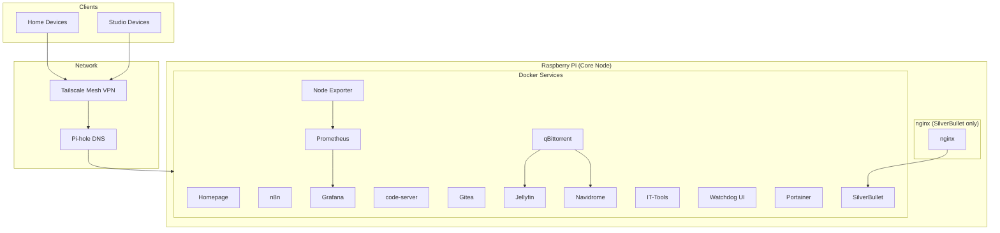

# Mithun’s Homelab

> A self-hosted, multi-location infrastructure built on a Raspberry Pi — slowly evolving into a full private cloud.

---

## Preview

<!-- Insert homepage screenshot here -->
<!--  -->

---

## Overview

This setup started as a simple experiment and turned into a fully functional homelab running multiple services, handling media, automation, development, and networking across two physical locations.

At its core, everything runs on a single Raspberry Pi with attached storage, but the network design and service stack push it way beyond a basic setup.

---

## Architecture

---

## Hardware

### Primary Node

- Raspberry Pi
- 2TB external hard drive
- Runs the entire container stack

### Planned Upgrade Path

- Building a Proxmox cluster using old PCs/laptops
- Goal:
  - Virtualization
  - Service isolation
  - Better reliability
  - Room to scale without everything living on one device

---

## Network Architecture

### Multi-location setup

- Two sites:
  - Home
  - Studio

- Connected using a mesh VPN with subnet routing

### What was done

- Bridged both networks together
- Resolved IP conflicts by restructuring subnet ranges
- Enabled cross-network communication

### Result

- Both locations behave like a single private network
- Services hosted at home are accessible from the studio as if they were local

---

## DNS & Network Control

### Pi-hole

- Router DNS is pointed to Pi-hole
- All devices across the network use it

### What this enables

- Network-wide ad blocking
- DNS-level visibility into traffic
- Centralized control over requests

---

## Services

Everything is containerized and managed through Docker.

### Core

- **Homepage**  
  Central dashboard for accessing all services

- **Portainer**  
  Container management UI

### Automation & Workflows

- **n8n**  
  Used for automation, integrations, and future pipelines

### Monitoring

- **Prometheus**  
  Metrics collection

- **Grafana**  
  Dashboards and visualization

- **Node Exporter**  
  System-level metrics

### Development

- **code-server**  
  Browser-based VS Code environment

- **Gitea**  
  Self-hosted Git service

### Custom Project

- **Watchdog UI (Streamlit)**  
  Custom dashboard / recon interface

### Utilities

- **IT-Tools**  
  Collection of useful dev and networking tools

### Media Stack

- **Jellyfin**  
  Media streaming server

- **Navidrome**  
  Music streaming server

- **qBittorrent**  
  Download manager

### Notes

- nginx is only used to provide HTTPS for SilverBullet
- Other services are accessed directly over their respective ports within the private network

---

## Media Library

- 247 movies
- 500 songs

All stored locally and streamed through the media stack.

---

## What This Setup Achieves

- A personal cloud running entirely on self-hosted infrastructure
- Cross-location networking without enterprise hardware
- Centralized DNS and traffic control
- Full media streaming system
- Development and automation environment in one place

---

## Current Limitations

- Single point of failure (everything runs on one machine)
- Resource constraints of Raspberry Pi
- Increasing complexity in networking and routing
- Heavy reliance on Pi-hole for DNS

---

## Roadmap

### Infrastructure

- Build and deploy Proxmox cluster
- Migrate services into VMs/containers across nodes
- Add redundancy and backups

### Observability

- Improve dashboards
- Add alerting and uptime monitoring

### Security

- Introduce access control layers
- Move toward a zero-trust style setup

### Expansion

- Add more internal services
- Secure external access where needed

---

## Final Thoughts

This setup proves you don’t need expensive hardware to build something powerful.  
It’s a mix of curiosity, trial and error, and stacking systems until it becomes something much bigger than intended.

And it’s still growing.
