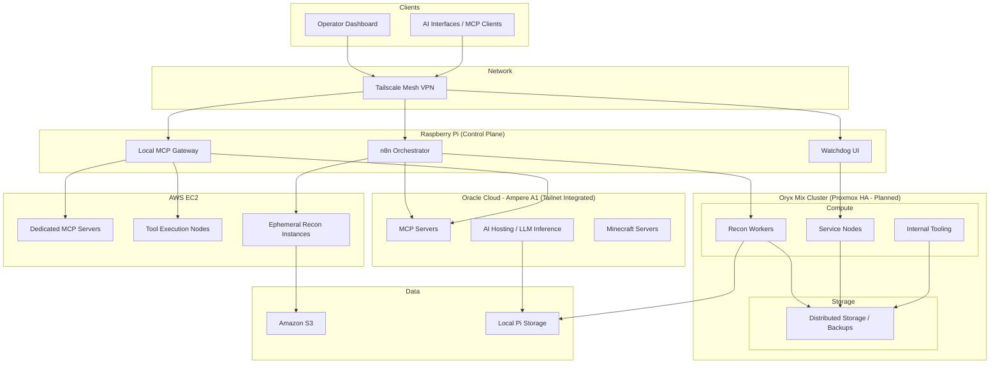

<p align="center">
  
</p>

<p align="center">
  
  
</p>

<br />

<p align="center">
I build systems that <b>observe, analyze, and scale</b>.
</p>

<p align="center">
Offensive security meets cloud-native engineering — designing recon pipelines, private infrastructure, and AI-powered tooling.
</p>

<br>

---

<h2 align="center">⚡ Core Stack</h2>

<h3 align="center">Infrastructure</h3>

<p align="center">
  
  <br/>
  
</p>

<h3 align="center">Development</h3>

<p align="center">
  
</p>

<h3 align="center">Observability & Control</h3>

<p align="center">
  
</p>

<br>

---

<h2 align="center">💀 Offensive Profile</h2>

```bash
mitch@watchdog:~$ whoami
FUll INFO.  : [Github Whoami](https://github.com/MKMithun2806/MKMithun2806/blob/main/Aboutme.md)
ROLE        : Red Team Aspirant
FOCUS       : Systems / Network / Physical Security
INTEREST    : Breaking infrastructure > web apps

mitch@watchdog:~$ tools --stack
Recon       : subfinder, naabu, httpx, nuclei, nmap, amass
Wireless    : aircrack-ng, hashcat, tcpdump, wireshark
Exploitation: metasploit, custom payloads
Infra       : n8n, docker, tailscale, proxmox

mitch@watchdog:~$ echo $CURRENT_OBJECTIVE
"Build scalable offensive infrastructure and operate as a Red Team Operator"

mitch@watchdog:~$ sudo access system
access granted: keep going.
```

---

<h2 align="center">🛰️ Flagship Project — Watchdog</h2>

<p align="center">
Hardware-triggered, cloud-native reconnaissance platform.
</p>

<p align="center">
Flipper Zero → ESP32 → n8n → Cloud Recon Workers → AI Analysis → Streamlit UI
</p>

---

<h2 align="center">⚙️ Infrastructure Ecosystem</h2>


---

<h2 align="center">🤖 AI-Augmented Development</h2>

<p align="center">
AI is not a chatbot — it's part of the system.
</p>

```bash
Workflow:
- Architecture design with AI
- Rapid infra scripting (Bash / Python)
- MCP servers for tool integration
- Automated recon + analysis pipelines

Philosophy:
AI doesn't replace engineering.
It amplifies it.
```

---

<h2 align="center">📊 GitHub Metrics</h2>

<p align="center">
  
  
  
</p>

<p align="center">
  
</p>

---

<h2 align="center">📡 Activity</h2>

<p align="center">
  
</p>

<p align="center">
  <picture>
    <source media="(prefers-color-scheme: dark)" srcset="https://raw.githubusercontent.com/MKMithun2806/MKMithun2806/output/github-snake-dark.svg" />
    <source media="(prefers-color-scheme: light)" srcset="https://raw.githubusercontent.com/MKMithun2806/MKMithun2806/output/github-snake.svg" />
    
  </picture>
</p>

---

<h2 align="center">🚀 Philosophy</h2>

<p align="center">
I don't build apps. I build systems.
</p>

<p align="center">
<b>Build infrastructure that sees everything — so nothing goes unnoticed.</b>
</p>
