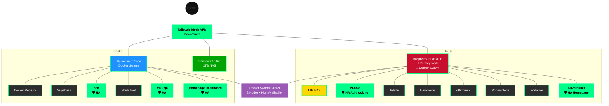

<p align="center">
  
</p>

<p align="center">
  
</p>

<br />

<p align="center">
I build systems that <b>observe, analyze, and act</b>.
</p>

<p align="center">
Building offensive infrastructure from the ground up; recon pipelines, cloud-native tooling, and the automation that makes it all scale.
</p>

<br>

---

## Top Projects

### Recon Pipelines

* 🔍 **[Watchdog-V2](https://github.com/MKMithun2806/Project-Watchdog-V2)**
  Automation-first ephemeral cloud reconnaissance pipeline that scans, analyzes, and generates AI-powered security reports stored in Supabase.

* 🌐 **[NetMalper](https://github.com/MKMithun2806/NetMalper)**
  Network discovery and attack-surface mapping platform that visualizes infrastructure relationships as an interactive graph.

* 🧪 **[VulnMalper](https://github.com/MKMithun2806/VulnMalper)**
  Vulnerability analysis pipeline that consumes NetMalper graphs. Fingerprint → Scan → Verify, with each stage enriching the next.

### Hacking Tools

* 🐚 **[ShellCraft](https://github.com/MKMithun2806/ShellCraft)**
  Lightweight Go CLI for generating cross-platform payloads and shell commands with a fast, interactive workflow.

* ⚡ **[PloitMalper](https://github.com/MKMithun2806/ploitmalper)**
  Post-exploitation analysis and vulnerability intelligence toolkit focused on validation, enrichment, and workflow automation. [ Stable ]

### General 

* 🏪 **[PBctl](https://github.com/MKMithun2806/pbctl)**
  **Infrastructure-as-Code for PocketBase** — A Rust CLI powered by PBSL (PocketBase Schema Language).  
Define collections as code, validate schemas, preview changes with `plan`, and apply them safely. Export live schemas, keep everything in Git, and treat PocketBase as runtime state.
  
---

## 🚧 Currently Building

* 🐉 **[SThunt](https://github.com/MKMithun2806/sthunt)**
  Stealth-focused fingerprinting framework for identifying WAFs, IDS/IPS solutions, CDNs, and layered security controls through a modern CLI experience. [ Not so stable ] [ Niche Project ]
  
---

## 🛠️ Open Source Contributions

- **[BishopFox Sliver](https://github.com/BishopFox/sliver)** — Contributor  
  Merged Pull Request [#2273](https://github.com/BishopFox/sliver/pull/2273) — Made reverse port forward `KeepAlive` period configurable.
  
  Merged Pull Request [#2316](https://github.com/BishopFox/sliver/pull/2316) - Update docs to mention absence of the "stagers" command.

- **[Pixelification](https://github.com/ahyanistheEmty/pixelification)** — Core Maintainer

- **[Aster Browser](https://github.com/ahyanistheEmty/Aster)** — Contributor

- **[sub-tui](https://github.com/MattiaPun/SubTUI)** — Not a contributor yet [PR tho](https://github.com/MattiaPun/SubTUI/pull/148)

---

<h2 align="center">Red Team Direction</h2> <p align="center"> Focused on learning offensive tradecraft, internal network testing, and building lab environments that simulate real targets. </p> <p align="center"> The goal is not just to use tools it is to understand systems deeply enough to break them. </p>

---

<h2 align="center">💀 Offensive Profile</h2>

```bash
mitch@watchdog:\~$ whoami
ROLE        : Red Team Operator Aspirant
FOCUS       : Internal Networks • Offensive Infrastructure • Physical Security
INTERESTS   : Recon Automation • Attack Simulation • Purpose-Built Tooling
STYLE       : Engineer first, attacker second — build what you break

mitch@watchdog:\~$ echo $CURRENT_OBJECTIVE
"Build resilient offensive infrastructure and evolve into a capable Red Team operator"

mitch@watchdog:\~$ echo $RECENT_WINS
→ Merged PR #2273 in BishopFox/sliver (configurable reverse portfwd KeepAlive)
→ Maintaining & shipping Pixelification (GPU image processing)
→ VulnMalper - pipes bruteforced credentials to sqlmap ( so it can find more endpoints)
→ NetMalper - Smart switching from rustscan → Naabu or viceversa depending on taret
→ PloitMalper - Added metasploit integ
→ sthunt - Prototype works!

mitch@watchdog:\~$ echo $PHILOSOPHY
"I have to deeply understand the infrastructure to truly break it."
```

---

<h2 align="center">⚡ Core Stack</h2>

<h3 align="center">Infrastructure</h3>

<p align="center">
  
  <br/>
  
  
  
</p>

<h3 align="center">Development</h3>

<p align="center">
  
  <p align="center">
  
  
  
</p>
</p>
<h3 align="center">Network & Control Plane</h3>

<p align="center">
  
  <br/><br/>
  
  
  
  
</p>
<br>

---

<h2 align="center">🛰️ Flagship Project — WatchDog</h2>

<p align="center">
Hardware-triggered, cloud-native reconnaissance platform.
</p>

<p align="center">
Flipper Zero → WebHook → AWS Lambda → Cloud Recon Workers → AI Analysis → Streamlit UI
</p>

---

<h2 align="center">⚙️ Infrastructure Ecosystem</h2>

## 🏠 Homelab Infrastructure

<p align="center">
  <strong>All nodes interconnected via <code>Tailscale</code> mesh VPN • Secure zero-trust access from anywhere</strong><br>
</p>


```mermaid
flowchart TD
    Internet((Internet))
    Tailscale[Tailscale Mesh VPN<br/>Zero-Trust]

    subgraph House ["House"]
        RasPi[Raspberry Pi 4B 8GB<br/>📍 Primary Node<br/>🐳 Docker Swarm]:::raspi
        NAS1[1TB NAS]:::nas
        PiHole[Pi-hole<br/>🛡️ HA Ad-blocking]:::ha
        Jellyfin[Jellyfin]:::service
        Navidrome[Navidrome]:::service
        QB[qBittorrent]:::service
        Phoneinfoga[PhoneInfoga]:::service
        Portainer[Portainer]:::service
        Silverbullet[Silverbullet<br/>🛡️ HA Homepage]:::ha
    end

    subgraph Studio ["Studio"]
        Alpine[Alpine Linux Node<br/>Docker Swarm]:::alpine
        WinNAS[Windows 10 PC<br/>2TB NAS]:::windows
        DockerReg[Docker Registry]:::service
        Supabase[Supabase]:::service
        N8N[n8n<br/>🛡️ HA]:::ha
        Spiderfoot[Spiderfoot]:::service
        Vikunja[Vikunja<br/>🛡️ HA]:::ha
        Homepage[Homepage Dashboard<br/>🛡️ HA]:::ha
    end

    %% Connections
    Internet --- Tailscale
    Tailscale --- RasPi
    Tailscale --- Alpine
    Tailscale --- WinNAS

    RasPi --- NAS1
    RasPi --- PiHole
    RasPi --- Jellyfin
    RasPi --- Navidrome
    RasPi --- QB
    RasPi --- Phoneinfoga
    RasPi --- Portainer
    RasPi --- Silverbullet

    Alpine --- DockerReg
    Alpine --- Supabase
    Alpine --- N8N
    Alpine --- Spiderfoot
    Alpine --- Vikunja
    Alpine --- Homepage

    %% Swarm & HA indicators
    Swarm[Docker Swarm Cluster<br/>2 Nodes • High Availability]:::swarm

    RasPi --- Swarm
    Alpine --- Swarm

    %% Styling
    classDef raspi fill:#C8102E,stroke:#00FF88,stroke-width:3px,color:#fff
    classDef alpine fill:#1E90FF,stroke:#00FF88,stroke-width:3px,color:#fff
    classDef windows fill:#00A300,stroke:#00FF88,stroke-width:3px,color:#fff
    classDef service fill:#2D2D2D,stroke:#00FF88,stroke-width:2px,color:#fff
    classDef nas fill:#FFD700,stroke:#00FF88,stroke-width:3px,color:#000
    classDef ha fill:#00FF88,stroke:#fff,stroke-width:3px,color:#000,font-weight:bold
    classDef swarm fill:#9B59B6,stroke:#fff,stroke-width:3px,color:#fff

    class RasPi raspi
    class Alpine alpine
    class WinNAS windows
    class NAS1 nas
    class PiHole,Silverbullet,N8N,Vikunja,Homepage ha
    class Jellyfin,Navidrome,QB,Phoneinfoga,Portainer,DockerReg,Supabase,Spiderfoot service
    class Swarm swarm

    style Internet fill:#111,stroke:#fff
    style Tailscale fill:#00FF88,stroke:#fff,color:#000,font-weight:bold
```
---

## Niche Projects
> I dont know why i made these

* ▶️ **[DLX](https://github.com/MKMithun2806/DLX)**
  Privacy-first, self-hosted, youtube mirror stack; Similar to TubeArchiveist just more simplified and lightweight

* 💀 **[ProxyHunt](https://github.com/MKMithun2806/proxyhunt)**
  fast, no-TUI, CLI-only version of proxy-scraper-checker focused on ease of use while keeping the same high-quality technical core. [ Stable ]
  
---

<h2 align="center">GitHub Metrics</h2>

<p align="center">
  
</p>

<p align="center">
  
</p>

<p align="center">
  <picture>
    <source media="(prefers-color-scheme: dark)" srcset="https://raw.githubusercontent.com/MKMithun2806/MKMithun2806/output/github-snake-dark.svg" />
    <source media="(prefers-color-scheme: light)" srcset="https://raw.githubusercontent.com/MKMithun2806/MKMithun2806/output/github-snake.svg" />
    
  </picture>
</p>

---

# Myself

*Built. Broken. Documented.*

---

## 🔗 Explore More

- 🧠 [About Me](https://github.com/MKMithun2806/MKMithun2806/blob/main/Aboutme.md): Nah, Dont Read This

- 🔴 [Security Reports](https://github.com/MKMithun2806/Security-Reports): Reports of Stuff i 'pwned' ( Hacked )

- [Dream infra/Homelab](https://github.com/MKMithun2806/MKMithun2806/blob/main/dreamsetup.md) 

- [⚙️ Homelab Deep Dive](https://github.com/MKMithun2806/MKMithun2806/blob/main/Homelab-docs.md): A Comprehensive explanation of my HomeServer

- [Me suffering](https://github.com/MKMithun2806/MKMithun2806/blob/main/my-evening-gone.md): trying to trouble shoot ine of my homelab nodes.
