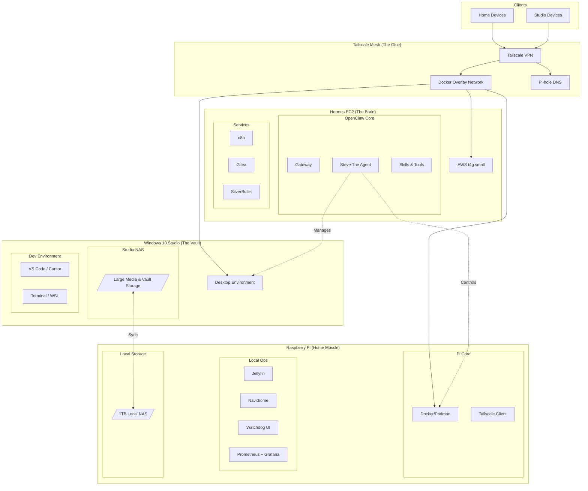

<p align="center">
  
</p>

<p align="center">
  
</p>

<br />

<p align="center">
I build systems that <b>observe, analyze, and act</b>.
</p>

<p align="center">
Building offensive infrastructure from the ground up; recon pipelines, cloud-native tooling, and the automation that makes it all scale.
</p>

<br>

---

## Top Projects

- 🔍 [*Watchdog-V2*](https://github.com/MKMithun2806/Project-Watchdog-V2)

  Automation-first ephemeral cloud recon pipeline that scans, analyzes, and saves AI-powered security reports to supabase.


- 🌐 [NetMalper](https://github.com/MKMithun2806/NetMalper)

  Network scanning and mapping tool for discovering devices and attack surface in a Graph

- 🧪 [VulnMalper](https://github.com/MKMithun2806/VulnMalper)

  Vulnerability pipeline that eats NetMalper graphs. Fingerprint → Scan → Verify, with every stage feeding the next.
  
- 🐉 [Kali Mcp Server](https://github.com/MKMithun2806/Kali-pentesting-mcp)

  Security testing tools exposed as MCP tools for use with Claude Desktop via Docker MCP Toolkit.

- 🐚 [ShellCraft](https://github.com/MKMithun2806/ShellCraft)

  A lightweight, interactive Go CLI tool for generating obfuscated, multi-platform reverse shell payloads on the fly.

- In Progress [PloitMalper](https://github.com/MKMithun2806/ploitmalper)

  Vulnerability Post-Processing and Analysis Toolkit: Still under active experimentation.

---

## 🛠️ Open Source Contributions

- **[BishopFox Sliver](https://github.com/BishopFox/sliver)** — Contributor  
  Merged Pull Request [#2273](https://github.com/BishopFox/sliver/pull/2273) — Made reverse port forward `KeepAlive` period configurable.

- **[Pixelification](https://github.com/ahyanistheEmty/pixelification)** — Core Maintainer

- **[Aster Browser](https://github.com/ahyanistheEmty/Aster)** — Contributor

---

<h2 align="center">Red Team Direction</h2> <p align="center"> Focused on learning offensive tradecraft, internal network testing, and building lab environments that simulate real targets. </p> <p align="center"> The goal is not just to use tools it is to understand systems deeply enough to break them. </p>

---

<h2 align="center">💀 Offensive Profile</h2>

```bash
mitch@watchdog:~$ whoami
ROLE        : Red Team Aspirant
FOCUS       : Internal Networks / Infrastructure / Physical Security
INTEREST    : Recon automation, attack simulation, lab-built tooling
STYLE       : Build systems that scale offensive work

mitch@watchdog:~$ maintained-projects

Pixelification
ROLE        : Maintainer
FOCUS       : GPU acceleration, image processing
REPOSITORY  : github.com/ahyanistheEmty/pixelification

mitch@watchdog:~$ echo $CURRENT_OBJECTIVE
"Build scalable offensive infrastructure and grow into a real Red Team operator"

mitch@watchdog:~$ echo $PHILOSOPHY
"I actually have to know the infrastructure to break it"
```

---

<h2 align="center">⚡ Core Stack</h2>

<h3 align="center">Infrastructure</h3>

<p align="center">
  
  <br/>
  
  
  
</p>

<h3 align="center">Development</h3>

<p align="center">
  
  <p align="center">
  
  
  
</p>
</p>
<h3 align="center">Network & Control Plane</h3>

<p align="center">
  
  <br/><br/>
  
  
  
  
</p>
<br>

---

<h2 align="center">🛰️ Flagship Project — WatchDog</h2>

<p align="center">
Hardware-triggered, cloud-native reconnaissance platform.
</p>

<p align="center">
Flipper Zero → WebHook → AWS Lambda → Cloud Recon Workers → AI Analysis → Streamlit UI
</p>

---

<h2 align="center">⚙️ Infrastructure Ecosystem</h2>

# Current Infra/Homelab


```mermaid
flowchart TB
    subgraph Clients
    A[Home Devices]
    B[Studio Devices]
    end
    subgraph Network_Fabric["Tailscale Mesh (The Glue)"]
    TS[Tailscale VPN]
    SWARM_NET[Docker Overlay Network]
    DNS[Pi-hole DNS]
    end
    A --> TS
    B --> TS
    TS --> DNS
    subgraph OpenClaw_EC2["Hermes EC2 (The Brain)"]
        EC2_AWS["AWS t4g.small"]
        subgraph OPENCLAW_CORE[OpenClaw Core]
            OC_GATEWAY[Gateway]
            OC_AGENT[Steve The Agent]
            OC_SKILLS[Skills & Tools]
        end
        subgraph EC2_SERVICES[Services]
            N8N_EC2[n8n]
            GITEA_EC2[Gitea]
            SILVER_EC2[SilverBullet]
        end
    end
    subgraph Raspberry_Pi["Raspberry Pi (Home Muscle)"]
        subgraph PI_CORE[Pi Core]
            PI_DOCKER[Docker/Podman]
            PI_TAIL[Tailscale Client]
        end
        subgraph HOME_SERVICES[Local Ops]
            JELLY[Jellyfin]
            NAVI[Navidrome]
            WATCHDOG[Watchdog UI]
            GRAFANA[Prometheus + Grafana]
        end
        subgraph PI_STORAGE[Local Storage]
            NAS_1TB[/"1TB Local NAS"/]
        end
    end
    subgraph Windows_Studio["Windows 10 Studio (The Vault)"]
        WIN_DESK[Desktop Environment]
        subgraph WIN_STORAGE[Studio NAS]
            WIN_NAS[/"Large Media & Vault Storage"/]
        end
        subgraph DEV_TOOLS[Dev Environment]
            VS_CODE[VS Code / Cursor]
            TERM[Terminal / WSL]
        end
    end
    %% Connections
    TS --> SWARM_NET
    SWARM_NET --> EC2_AWS
    SWARM_NET --> PI_DOCKER
    SWARM_NET --> WIN_DESK
    OC_AGENT -.->|Controls| PI_DOCKER
    OC_AGENT -.->|Manages| WIN_DESK
    WIN_NAS <-->|Sync| NAS_1TB
```

---

<h2 align="center">📊 GitHub Metrics</h2>

<p align="center">
  
</p>

<p align="center">
  
</p>

<p align="center">
  
</p>

<p align="center">
  <picture>
    <source media="(prefers-color-scheme: dark)" srcset="https://raw.githubusercontent.com/MKMithun2806/MKMithun2806/output/github-snake-dark.svg" />
    <source media="(prefers-color-scheme: light)" srcset="https://raw.githubusercontent.com/MKMithun2806/MKMithun2806/output/github-snake.svg" />
    
  </picture>
</p>

---

# Myself

*Built. Broken. Documented.*

---

## 🔗 Explore More

- 🧠 [About Me](https://github.com/MKMithun2806/MKMithun2806/blob/main/Aboutme.md): Nah, Dont Read This

- 🔴 [Security Reports](https://github.com/MKMithun2806/Security-Reports): Reports of Stuff i 'pwned' ( Hacked )

- [Dream infra/Homelab](https://github.com/MKMithun2806/MKMithun2806/blob/main/dreamsetup.md) 

- [⚙️ Homelab Deep Dive](https://github.com/MKMithun2806/MKMithun2806/blob/main/Homelab-docs.md): A Comprehensive explanation of my HomeServer
