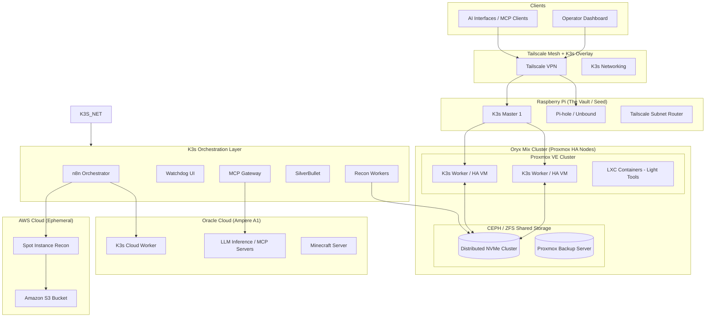
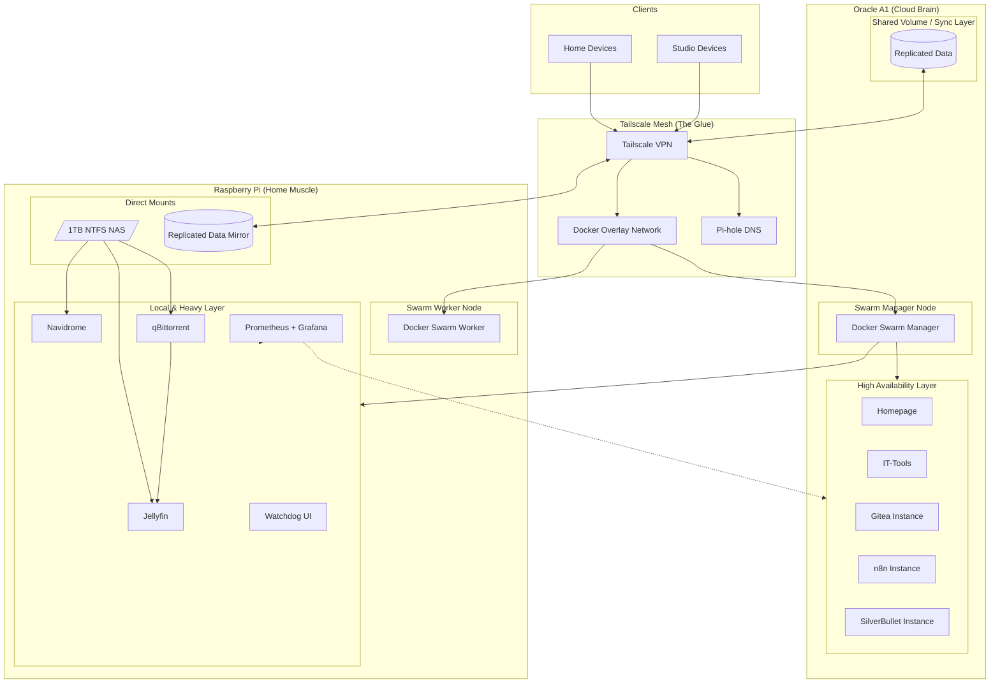

<p align="center">
  
</p>

<p align="center">
  
  
</p>

<br />

<p align="center">
I build systems that <b>observe, analyze, and scale</b>.
</p>

<p align="center">
Offensive security meets cloud-native engineering — designing recon pipelines, private infrastructure, and AI-powered tooling.
</p>

<br>

---

<h2 align="center">⚡ Core Stack</h2>

<h3 align="center">Infrastructure</h3>

<p align="center">
  
  <br/>
  
  
  
</p>

<h3 align="center">Development</h3>

<p align="center">
  
  <p align="center">
  
  
  
</p>
</p>
<h3 align="center">Network & Control Plane</h3>

<p align="center">
  
  <br/><br/>
  
  
  
</p>
<br>

---

<h2 align="center">💀 Offensive Profile</h2>

```bash
mitch@watchdog:~$ whoami
ROLE        : Red Team Aspirant
FOCUS       : Systems / Network / Physical Security
INTEREST    : Breaking infrastructure > web apps
"You build pipelines — not one-off exploits."

mitch@watchdog:~$ tools --stack

Recon       : subfinder, naabu, httpx, nuclei, nmap, amass
Wireless    : aircrack-ng, hashcat, tcpdump, wireshark
Exploitation: metasploit, custom payloads
Infra       : n8n, docker, tailscale, proxmox

mitch@watchdog:~$ echo $CURRENT_OBJECTIVE
"Build scalable offensive infrastructure and operate as a Red Team Operator"

mitch@watchdog:~$ sudo access system
access granted: keep going.
```

---

<h2 align="center">🛰️ Flagship Project — Watchdog</h2>

<p align="center">
Hardware-triggered, cloud-native reconnaissance platform.
</p>

<p align="center">
Flipper Zero → ESP32 → n8n → Cloud Recon Workers → AI Analysis → Streamlit UI
</p>

---

<h2 align="center">⚙️ Infrastructure Ecosystem</h2>

# Hypothesised 


```mermaid
flowchart TB

%% ================= CLIENT LAYER =================
subgraph Clients
    U1[Operator Dashboard]
    U2[AI Interfaces / MCP Clients]
end

%% ================= NETWORK MESH =================
subgraph Network_Fabric[Tailscale Mesh + K3s Overlay]
    TS[Tailscale VPN]
    K8S_CNI[K3s Networking]
end

U1 --> TS
U2 --> TS

%% ================= BUNKER LAYER =================
subgraph Pi_Bunker["Raspberry Pi (The Vault / Seed)"]
    direction TB
    K3S_M[K3s Master 1]
    DNS[Pi-hole / Unbound]
    TS_SUB[Tailscale Subnet Router]
end

TS --> K3S_M
TS --> DNS

%% ================= ORYX CLUSTER (HA) =================
subgraph OROX["Oryx Mix Cluster (Proxmox HA Nodes)"]
    direction TB
    
    subgraph PVE_HA[Proxmox VE Cluster]
        K3S_W1[K3s Worker / HA VM]
        K3S_W2[K3s Worker / HA VM]
        LXC_TOOLS[LXC Containers - Light Tools]
    end

    subgraph HA_Storage[CEPH / ZFS Shared Storage]
        ST1[(Distributed NVMe Cluster)]
        BK[(Proxmox Backup Server)]
    end

    K3S_W1 <--> ST1
    K3S_W2 <--> ST1
end

%% ================= DISTRIBUTED SERVICES =================
subgraph K3S_SERVICES[K3s Orchestration Layer]
    N8N[n8n Orchestrator]
    WATCH[Watchdog UI]
    MCP_GATE[MCP Gateway]
    SB[SilverBullet]
    RECON_W[Recon Workers]
end

K3S_M --> K3S_W1
K3S_M --> K3S_W2

%% ================= CLOUD EXTENSIONS =================
subgraph OCI["Oracle Cloud (Ampere A1)"]
    OCI_W[K3s Cloud Worker]
    AI_HOST[LLM Inference / MCP Servers]
    MC[Minecraft Server]
end

subgraph AWS["AWS Cloud (Ephemeral)"]
    EC2_SPOT[Spot Instance Recon]
    S3[Amazon S3 Bucket]
end

%% ================= DATA FLOWS =================
N8N --> OCI_W
N8N --> EC2_SPOT
MCP_GATE --> AI_HOST
EC2_SPOT --> S3
RECON_W --> ST1

%% Relationships
K3S_NET --> K3S_SERVICES
```
# Current


```mermaid
flowchart TB
subgraph Clients
A[Home Devices]
B[Studio Devices]
end
subgraph Network_Fabric["Tailscale Mesh (The Glue)"]
TS[Tailscale VPN]
SWARM_NET[Docker Overlay Network]
DNS[Pi-hole DNS]
end
A --> TS
B --> TS
TS --> DNS
subgraph Oracle_Cloud["Oracle A1 (Cloud Brain)"]

subgraph SWARM_MANAGER[Swarm Manager Node]
    MANAGER[Docker Swarm Manager]
end

subgraph CLOUD_SERVICES[High Availability Layer]
    HOMEPAGE[Homepage]
    IT[IT-Tools]
    GITEA_C[Gitea Instance]
    N8N_C[n8n Instance]
    SB_C[SilverBullet Instance]
end

subgraph CLOUD_STORAGE[Shared Volume / Sync Layer]
    SYNC_DATA[(Replicated Data)]
end
end
subgraph Raspberry_Pi["Raspberry Pi (Home Muscle)"]

subgraph SWARM_WORKER[Swarm Worker Node]
    WORKER[Docker Swarm Worker]
end

subgraph HOME_SERVICES[Local & Heavy Layer]
    JELLY[Jellyfin]
    NAVI[Navidrome]
    QBIT[qBittorrent]
    WATCHDOG[Watchdog UI]
    PRO_STACK[Prometheus + Grafana]
end

subgraph LOCAL_STORAGE[Direct Mounts]
    NAS[/"1TB NTFS NAS"/]
    SYNC_PI[(Replicated Data Mirror)]
end
end
%% Connections
TS --> SWARM_NET
SWARM_NET --> MANAGER
SWARM_NET --> WORKER
MANAGER --> CLOUD_SERVICES
MANAGER --> HOME_SERVICES
%% Storage Mapping
NAS --> JELLY
NAS --> NAVI
NAS --> QBIT
SYNC_DATA <--> TS <--> SYNC_PI
%% Logic
PRO_STACK -.-> CLOUD_SERVICES
PRO_STACK -.-> HOME_SERVICES
QBIT --> JELLY
```
---

<h2 align="center">🤖 AI-Augmented Development</h2>

<p align="center">
AI is not a chatbot — it's part of the system.
</p>

```bash
Workflow:
- Architecture design with AI
- Rapid infra scripting (Bash / Python)
- MCP servers for tool integration
- Automated recon + analysis pipelines

Philosophy:
AI doesn't replace engineering.
It amplifies it.
```

---

<h2 align="center">📊 GitHub Metrics</h2>

<p align="center">
  
  
  
</p>

<p align="center">
  
</p>

---

<h2 align="center">📡 Activity</h2>

<p align="center">
  
</p>

<p align="center">
  <picture>
    <source media="(prefers-color-scheme: dark)" srcset="https://raw.githubusercontent.com/MKMithun2806/MKMithun2806/output/github-snake-dark.svg" />
    <source media="(prefers-color-scheme: light)" srcset="https://raw.githubusercontent.com/MKMithun2806/MKMithun2806/output/github-snake.svg" />
    
  </picture>
</p>

---

<h2 align="center">🚀 Philosophy</h2>

<p align="center">
I don't build apps. I build systems.
</p>

<p align="center">
<b>Build infrastructure that sees everything — so nothing goes unnoticed.</b>
</p>

# If u Plan on stalking me

*i really need a server computer or rack to use proxmox on smth othern then in VMware😭😭😭*

*Built. Broken. Documented.*

[🧠 About me](https://github.com/MKMithun2806/MKMithun2806/blob/main/Aboutme.md)

[⚙️ Homelab Deep Dive](https://github.com/MKMithun2806/MKMithun2806/blob/main/Homelab-docs.md)

[🔴 Security Reports (Real Exploits & Findings)](https://github.com/MKMithun2806/Security-Reports)
