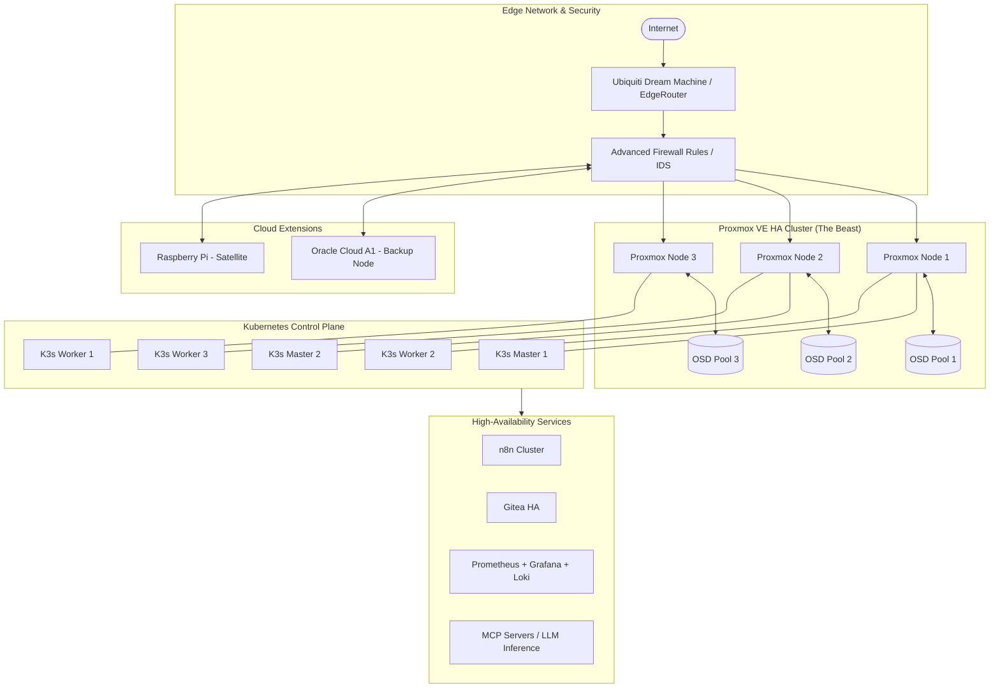

# 🔮 Future Architecture (The Dream Setup)

```mermaid
flowchart TB
    subgraph Edge["Edge Network & Security"]
        ISP([Internet])
        UDM[Ubiquiti Dream Machine / EdgeRouter]
        FW[Advanced Firewall Rules / IDS]
        ISP --> UDM
        UDM --> FW
    end

    subgraph Proxmox_Cluster["Proxmox VE HA Cluster (The Beast)"]
        direction TB
        PVE1[Proxmox Node 1]
        PVE2[Proxmox Node 2]
        PVE3[Proxmox Node 3]
        CEPH_OSD1[(OSD Pool 1)]
        CEPH_OSD2[(OSD Pool 2)]
        CEPH_OSD3[(OSD Pool 3)]
        PVE1 <--> CEPH_OSD1
        PVE2 <--> CEPH_OSD2
        PVE3 <--> CEPH_OSD3
    end

    subgraph K3s_Grid["Kubernetes Control Plane"]
        K3S_M1[K3s Master 1]
        K3S_M2[K3s Master 2]
        K3S_W1[K3s Worker 1]
        K3S_W2[K3s Worker 2]
        K3S_W3[K3s Worker 3]
    end

    FW --> PVE1
    FW --> PVE2
    FW --> PVE3

    PVE1 --- K3S_M1
    PVE2 --- K3S_M2
    PVE3 --- K3S_W1
    PVE1 --- K3S_W2
    PVE2 --- K3S_W3

    subgraph Cloud_Ext["Cloud Extensions"]
        ORACLE[Oracle Cloud A1 - Backup Node]
        RPI[Raspberry Pi - Satellite]
    end

    FW <--> ORACLE
    FW <--> RPI

    subgraph Services["High-Availability Services"]
        N8N_HA[n8n Cluster]
        GITEA_HA[Gitea HA]
        MON[Prometheus + Grafana + Loki]
        AI[MCP Servers / LLM Inference]
    end

    K3s_Grid --> Services
```
